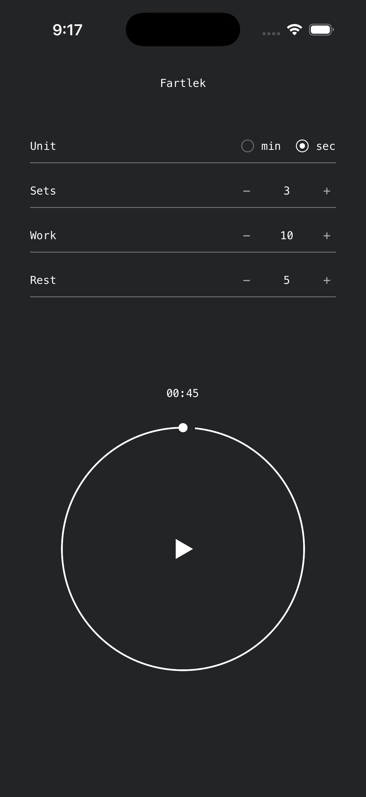

# Fartlek

A minimal interval timer for set-based workouts. Configure your sets, work, and rest; press play. One screen, no clutter — a list over a progress ring, in monochrome with a single accent color per set.

## Features

### Timer
- **Simple session model** — `sets × (work + rest)`, with the total session time computed live as you configure
- **5-second get-ready countdown** before the first set so you can get in position
- **Per-phase progress ring** — the dot sweeps one full lap for each phase (prep, work, rest), so a glance tells you how far into the current interval you are
- **Session countdown** above the ring in `mm:ss`
- **Drift-free timing** — timestamp-based clock that stays accurate through pauses, backgrounding, and long sessions

### Controls
- **One control, in the center of the ring** — play to start or resume, pause while running
- **Hold to reset** the timer back to configuration
- **Shake to pause** mid-workout; shake again while paused to stop — no need to look at the screen
- **Steppers, not keyboards** — every value adjusts with +/− taps; zero shows as `None`

### Configuration
- Sets, work duration, and rest duration
- Seconds or minutes, switchable with one tap
- Defaults: 3 sets × (10s work + 5s rest)

